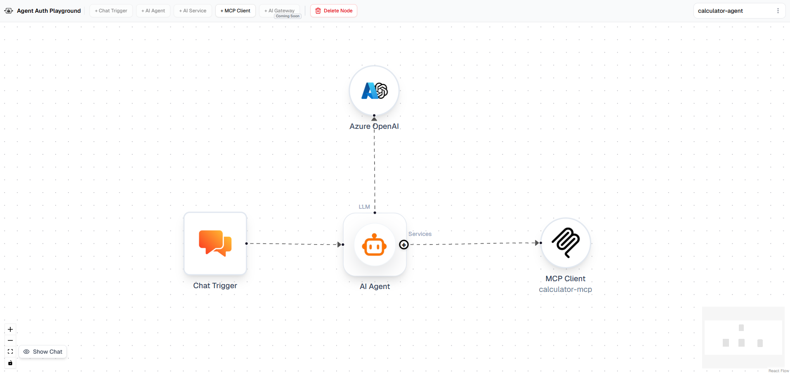

# Calculator Agent - Setup Guide

A calculator assistant AgentFlow that demonstrates authenticated MCP tool usage. The agent can add, subtract, multiply, divide, raise powers, compute square roots, and calculate remainders — all protected by Asgardeo / WSO2 Identity Server OAuth2 via the On-Behalf-Of (OBO) flow.

## Workflow Overview



---

## Step 1 - Load the Workflow

1. Open **agent-auth-playground** (`npx agent-auth-playground`, then navigate to `http://localhost:4829`).
2. Click **Import** in the top toolbar and select [calculator-agent.json](calculator-agent.json).
3. The canvas loads with the pre-wired nodes. Continue through the steps below to fill in the empty configuration fields.

---

## Step 2 - Configure the AI Service Node

Double-click the **AI Service** node and select your preferred LLM provider, model, and credentials.

For full configuration details, see [this guide](../../documentation/nodes/llm.md).

---

## Step 3 - Set Up an Identity Provider

The calculator MCP server requires an OAuth2 token issued by an identity provider. Pick one:

**Option A - Asgardeo (cloud)**
Sign up for a free account at [asgardeo.io](https://asgardeo.io/). Your organization base URL will be `https://api.asgardeo.io/t/<your-org>`.

**Option B - WSO2 Identity Server (self-hosted)**
Download and install WSO2 IS from the [official downloads page](https://wso2.com/products/downloads/?product=wso2is). Your base URL will typically be `https://localhost:9443`.

---

## Step 4 - Configure the AI Agent Node

The AI Agent node needs credentials to authenticate with Asgardeo / WSO2 IS on behalf of itself and on behalf of you (OBO Flow).

1. Register an Interactive AI Agent by following the [Asgardeo guide](https://wso2.com/asgardeo/docs/guides/agentic-ai/ai-agents/register-and-manage-agents/#registering-an-ai-agent). Set the callback URL to `http://localhost:4829` during registration. Enable **PKCE** and **Public client** on the agent application.
2. Double-click the **AI Agent** node.
3. In the **+ Add Agent Credentials** section, fill in:

   | Field | Value |
   |-------|-------|
   | **Name** | Any label, e.g. `Calculator-Agent` |
   | **Agent ID** | The Agent ID from your Asgardeo registration |
   | **Agent Secret** | The corresponding Agent Secret |
   | **Base URL** | Your Asgardeo org URL or WSO2 IS URL |
   | **Agent Application Client ID** | The OAuth2 application client ID |

4. Click **Save**, then click **Test Fetching an Agent Token** to verify the credentials work.

For full configuration details, see [this guide](../../documentation/nodes/ai-agent.md).

---

## Step 5 - Register MCP Client Application and MCP Server in the IdP

### MCP Client Application Registration

1. Register a new MCP Client application for the Calculator MCP server. Set the Redirect URL to `http://localhost:4829`. (Refer to this [guide](https://wso2.com/asgardeo/docs/guides/agentic-ai/mcp/register-mcp-client-app/))
2. In the Advanced tab of the application enable **App-Native Authentication**.
3. Note down the client ID - you will need it in Steps 6 and 7.

### MCP Server Registration

1. Register a new MCP Server resource for the Calculator MCP server.
2. Follow this [guide](https://wso2.com/asgardeo/docs/guides/agentic-ai/mcp/mcp-server-authorization/) and use these details:
   - **Identifier:** `http://localhost:3010/mcp`
   - **Scopes:** `add subtract multiply divide power sqrt modulo`
3. Authorize the MCP Client application to access the Calculator MCP server.

### Create a Role and Assign to User

1. Create a new role in your IdP, e.g. `calculator_role`.
2. While creating the role, assign the Calculator MCP Client application, the Calculator MCP Server resource, and all its scopes.
3. After creation, assign the role to your agent.

For detailed instructions on creating roles refer to this [guide](https://wso2.com/asgardeo/docs/guides/users/manage-roles/#create-a-role).

---

## Step 6 - Start the MCP Server

### Install dependencies

From this directory, run:

```bash
cd calculator-mcp-servers
npm install
```

### Configure environment variables

Copy `.env.example` to `.env` and fill in the values for your identity provider:

```bash
cp .env.example .env
```

```env
# Base URL of your Asgardeo organization or WSO2 IS instance
BASE_URL=https://api.asgardeo.io/t/<your-org>  # or https://localhost:9443

# Client ID of the calculator MCP client application registered in your IdP
AUDIENCE_CALCULATOR_SERVER=<client-id-for-calculator>
```

### Start the server

```bash
npm start
```

| Server | Port | Auth |
|--------|------|------|
| Calculator MCP | 3010 | (Asgardeo / WSO2 IS) |

---

## Step 7 - Configure the MCP Client Node

Double-click the **calculator-mcp** node.

1. Make sure **Use MCP OAuth2** is toggled on.
2. Under **OAuth2 Configuration**, click **+ Add** and fill in:

   | Field | Value |
   |-------|-------|
   | **Name** | A friendly label, e.g. `Calculator – Dev` |
   | **Base URL** | Same base URL as your AI Agent credentials |
   | **Client ID** | The client ID from Step 5 |
   | **Scope** | `add subtract multiply divide power sqrt modulo` |

3. Click **Save**, then select the newly saved configuration from the dropdown.

The **Auth Flow** is set to **Agent Flow** — the calculator scopes are granted by the agent.

The **Redirect URI** is derived automatically from the app's origin (`http://localhost:4829`).

---

## Testing the Agent

Open the chat panel and try queries like the ones below. These will prompt an **Authorize** button — click it to open a login popup and grant consent before the tool call proceeds.

- "What is 128 divided by 4?"
- "Calculate 7 to the power of 3."
- "What is the square root of 144?"
- "Add 57 and 83, then multiply the result by 2."
- "What is 100 modulo 7?"

---

## View the Auth Flow

After running a query, click **View Auth Flow** to see the full sequence of steps taken to fetch the agent token - including the interactions with the identity provider and the token contents.