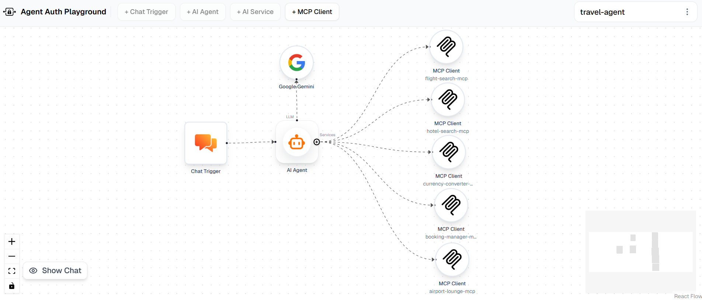
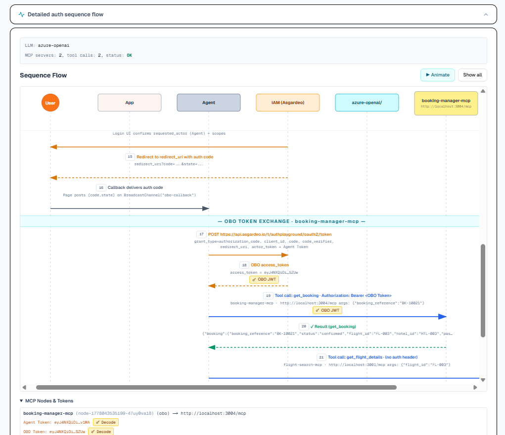

# Travel Agent - Setup Guide

A full-featured travel assistant AgentFlow that demonstrates authenticated and unauthenticated MCP tool usage. The agent can search flights, search hotels, convert currencies, create bookings, and reserve airport lounges - with Booking Manager and Airport Lounge Manager are protected by Asgardeo / WSO2 Identity Server OAuth2.

## Workflow Overview



---

## Step 1 - Load the Workflow

1. Open **agent-auth-playground** (`npx agent-auth-playground`, then navigate to `http://localhost:4829`).
2. Click **Import** in the top toolbar and select [travel-agent.json](travel-agent.json).
3. The canvas loads with the pre-wired nodes. Continue through the steps below to fill in the empty configuration fields.

---

## Step 2 - Configure the AI Service Node

Double-click the **AI Service** node and select your preferred LLM provider, model, and credentials.

For full configuration details, see [this guide](../../documentation/nodes/llm.md).

---

## Step 3 - Set Up an Identity Provider

The two protected MCP servers (Booking Manager, Airport Lounge) require OAuth2 tokens issued by an identity provider. Pick one:

**Option A - Asgardeo (cloud)**
Sign up for a free account at [asgardeo.io](https://asgardeo.io/). Your organization base URL will be `https://api.asgardeo.io/t/<your-org>`.

**Option B - WSO2 Identity Server (self-hosted)**
Download and install WSO2 IS from the [official downloads page](https://wso2.com/products/downloads/?product=wso2is). Your base URL will typically be `https://localhost:9443`.

---

## Step 4 - Configure the AI Agent Node

The AI Agent node needs credentials so it can authenticate with Asgardeo / WSO2 IS on behalf of itself (Agent Flow) and on behalf of you (OBO Flow).

1. Register an Interactive AI Agent by following the [Asgardeo guide](https://wso2.com/asgardeo/docs/guides/agentic-ai/ai-agents/register-and-manage-agents/#registering-an-ai-agent). Set the callback URL to `http://localhost:4829` during registration. Enable **PKCE** and **Public client** on the agent application.
2. Double-click the **AI Agent** node.
3. In the **+ Add Agent Credentials** section, fill in:

   | Field | Value |
   |-------|-------|
   | **Name** | Any label, e.g. `Travel-Agent` |
   | **Agent ID** | The Agent ID from your Asgardeo registration |
   | **Agent Secret** | The corresponding Agent Secret |
   | **Base URL** | Your Asgardeo org URL or WSO2 IS URL |
   | **Agent Application Client ID** | The OAuth2 application client ID |

4. Click **Save**, then click **Test Fetching an Agent Token** to verify the credentials work.

For full configuration details, see [this guide](../../documentation/nodes/ai-agent.md).

---

## Step 5 — Register MCP Client Applications and MCP Servers in the IdP

The two protected MCP servers (Booking Manager, Airport Lounge) require their own OAuth2 client registrations in the IdP. Each server will validate incoming tokens against its registered client ID.

Go to console of your IdP (Asgardeo or WSO2 IS).

### MCP Client Application Registration
1. Register two new MCP Client applications, one for the Booking Manager mcp server and one for the Airport Lounge mcp server. Set the  Redirect URL to `http://localhost:4829` for both. (Refer this [guide](https://wso2.com/asgardeo/docs/guides/agentic-ai/mcp/register-mcp-client-app/))
2. In the Advanced tab of the application enable App-Native Authentication.
3. Note down the client IDs for both applications - you will need them later.

### MCP Server Registration
1. Register two new MCP Server resources, one for the Booking Manager mcp server and one for the Airport Lounge mcp server.
2. Follow this [guide](https://wso2.com/asgardeo/docs/guides/agentic-ai/mcp/mcp-server-authorization/) and use below details in the registation:
   Use identifiers as below::
      - Booking Manager mcp Server: `http://localhost:3004/mcp`
      - Airport Lounge mcp Server: `http://localhost:3005/mcp`
   Use Scope as below::
      - Booking Manager mcp Server: `create_booking get_booking cancel_booking `
      - Airport Lounge mcp Server: `search_lounges get_lounge_details reserve_lounge`
3. Authorize the MCP Client applications to access the MCP servers.

### Create Roles and Assign to Agent and User

1. Create two new roles in your IdP, e.g. `booking_manager_role` and `airport_lounge_role`. 
2. While creation assign corresponding MCP Client application, Resource and Scope to each role.
3. After creation,
   - For the booking_manager_role, only assign the your user account. (If you haven't created a user, create refering this [guide](https://wso2.com/asgardeo/docs/guides/users/onboard-users/#onboard-single-user))
   - For the airport_lounge_role, assign the agent we created in Step 4 and your user account.

For detailed instructions on creating roles refer to this [guide](https://wso2.com/asgardeo/docs/guides/users/manage-roles/#create-a-role).

## Step 6 - Start the MCP Servers

### Install dependencies

from this directory, run:

```bash
cd travel-mcp-servers
npm install
```

### Configure environment variables

Copy `.env.example` to `.env` and fill in the values for your identity provider:

```bash
cp .env.example .env
```

```env
# Base URL of your Asgardeo organization or WSO2 IS instance
BASE_URL=https://api.asgardeo.io/t/<your-org> or https://localhost:9443

# Client IDs of the MCP client applications registered in your IdP
AUDIENCE_BOOKING_MANAGER_SERVER=<client-id-for-booking-manager>
AUDIENCE_AIRPORT_LOUNGE_SERVER=<client-id-for-airport-lounge>
```

The three no-auth servers (Flight Search, Hotel Search, Currency Converter) do not need any environment variables.

### Start all servers

```bash
npm start
```

This starts all five servers in a single terminal with color-coded output:

| Server | Port | Auth |
|--------|------|------|
| Flight Search | 3001 | None |
| Hotel Search | 3002 | None |
| Currency Converter | 3003 | None |
| Booking Manager | 3004 | OBO (Asgardeo) |
| Airport Lounge | 3005 | OBO (Asgardeo) |

---

## Step 7 — Configure the MCP Client Nodes

Each MCP Client node is pre-configured with its endpoint URL. The two protected nodes need an OAuth2 Configuration assigned.

### No-auth nodes

| Node | Endpoint |
|------|----------|
| flight-search-mcp | `http://localhost:3001/mcp` |
| hotel-search-mcp | `http://localhost:3002/mcp` |
| currency-converter-mcp | `http://localhost:3003/mcp` |

Click **Initialize & Connect** on each of these three nodes to connect to the MCP server and discover tools.

### Auth-protected nodes

Double-click the **booking-manager-mcp** node and the **airport-lounge-mcp** node. For each:

1. Make sure **Use MCP OAuth2** is toggled on.
2. Under **OAuth2 Configuration**, click **+ Add** and fill in:

   | Field | Value |
   |-------|-------|
   | **Name** | A friendly label, e.g. `Booking Manager – Dev` |
   | **Base URL** | Same base URL as your AI Agent credentials |
   | **Client ID** | The matching client ID for this MCP client node |
   | **Scope** | The scopes created for this server (see Step 5) |

3. Click **Save**, then select the newly saved configuration from the dropdown.

The Auth Flow for Booking Manager is set to **On Behalf Of (OBO)** because the required scopes can only be granted by the user. The Auth Flow for Airport Lounge is set to **Agent Flow** because the agent itself holds the required scopes.

The **Redirect URI** is derived automatically from the app's origin (`http://localhost:4829`) and does not need to be entered.

---

## Testing the Agent

Open the chat panel and try one of the queries below. Queries marked *(auth)* will prompt an **Authorize** button - click it to open a login popup and grant consent before the tool call proceeds.

### Single-tool queries

- "What are the current exchange rates for US dollars?"
- "Find me economy flights from JFK to London for 2 passengers."
- "Show me the details of my existing booking BK-10021." *(auth)*

### Multi-tool queries

- "Find hotels in Dubai and give me the full room types and cancellation policy of the highest-rated one."
- "I'm flying from JFK to London. Find me an economy flight, get its full details, search for 5-star hotels in London, and book the flight and one hotel room together." *(auth)*

---

## View the Auth Flow

To see the auth flow, open the **View Auth Flow** button after running an auth-protected query. You can see the sequence of steps taken to fetch the tokens, including the interactions with the identity provider and the token contents.


