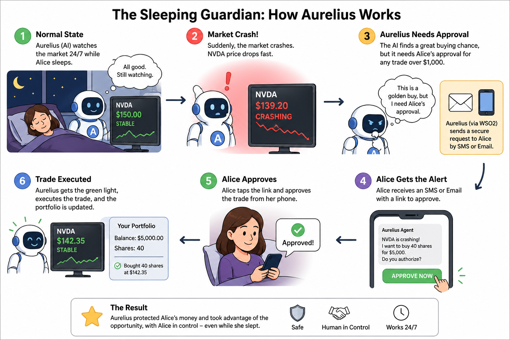

# The Sleeping Guardian: AI Agent with CIBA Authorization

A demonstration of **Client Initiated Backchannel Authentication (CIBA)** using a proactive AI agent that monitors stock markets and requests human authorization before executing high-value trades through an MCP (Model Context Protocol) server.

## The Story

**Meet Alice**, a high-net-worth investor who uses **Aurelius**, her personal AI agent that runs as a background service. Aurelius's job is to continuously watch the stock market 24/7 and protect Alice's portfolio from market crashes by identifying "Golden Buy" opportunities.

**The Conflict**: It's 3:00 AM. Alice is asleep. Suddenly, NVDA stock crashes 15% due to a market event. Aurelius detects this as a golden opportunity to buy shares at a discount. However, Alice has a security policy: **Any trade over $1,000 requires manual approval**.

**The Solution**: Aurelius cannot log Alice in. Instead, it uses **CIBA (Client Initiated Backchannel Authentication)** via WSO2 Identity Server (Asgardeo). Aurelius initiates a backchannel request, and Alice receives an SMS/Email notification. She taps a link, reviews the trade details, and approves it from her phone—all without leaving her bed. Aurelius receives the authorization token and executes the trade via a protected MCP Stock Trading Server.



## Architecture

This demo consists of four main components:

1. **Market Engine**: A synthetic stock market simulator that allows you to trigger controlled market events
2. **Aurelius Agent**: An LLM-powered AI agent that monitors prices and makes autonomous trading decisions
3. **MCP Stock Server**: A secured Model Context Protocol server that exposes stock trading tools with scope-based authorization
4. **CIBA Client**: Integration with WSO2 Identity Server (Asgardeo) for secure, asynchronous user authorization

```
┌─────────────────┐     ┌──────────────────────┐     ┌─────────────────┐
│  Market Engine  │────▶│  Aurelius Agent      │────▶│  CIBA Client    │
│  (Simulator)    │     │  (LLM + Monitoring)  │     │  (Asgardeo)     │
└─────────────────┘     └──────────────────────┘     └─────────────────┘
         │                       │                            │
         │                       │ Agent Token (stock:read)   │
         │                       │◄───────────────────────────┤
         │                       │                            │
         │                       │ Price drops!               │
         │                       │ Initiate CIBA request      │
         │                       │───────────────────────────▶│
         │                       │                            │
         │                       │                            ▼
         │                       │                   ┌─────────────────┐
         │                       │                   │ Email/SMS to    │
         │                       │                   │ Alice's Phone   │
         │                       │                   └─────────────────┘
         │                       │                            │
         │                       │                            ▼
         │                       │                   ┌─────────────────┐
         │                       │ OBO Token         │ User Approves   │
         │                       │◄──────────────────│ on Mobile       │
         │                       │ (stock:trade)     └─────────────────┘
         │                       │
         │                       ▼
         │              ┌─────────────────────┐
         └─────────────▶│  MCP Stock Server   │
                        │  (JWT Protected)    │
                        └─────────────────────┘
                                 │
                                 ▼
                        ┌─────────────────────┐
                        │   Trade Executed    │
                        │   Portfolio Updated │
                        └─────────────────────┘
```

## Features

- **Real-time Market Simulation**: Controllable stock price movements and market crashes
- **LLM-Powered AI Agent**: Uses Google Gemini to make intelligent trading decisions
- **MCP-Based Tool Access**: Agent interacts with protected stock trading tools via Model Context Protocol
- **Scope-Based Authorization**: Agent has `stock:read` permission; requires CIBA for `stock:trade`
- **Secure CIBA Authorization**: Human-in-the-loop approval via backchannel authentication
- **On-Behalf-Of Flow**: Agent acts on behalf of the user after approval
- **Live Dashboard**: Beautiful web interface showing market status and portfolio
- **Complete Audit Trail**: Full history of agent activities and decisions

## Prerequisites

Before starting, ensure you have:

- **Python 3.12 or higher**
- **WSO2 Asgardeo Account**: Sign up at https://console.asgardeo.io
- **Google AI API Key**: For Gemini LLM (get from https://aistudio.google.com/app/apikey)
- **Email Access**: For receiving CIBA approval notifications

## Quick Start Summary

If you want a quick overview before diving into details:

### Setup Checklist

**Asgardeo Configuration** (Detailed in "WSO2 Asgardeo Setup" section):
- [ ] Create "Aurelius Trading Agent" MCP Client application (for agent auth)
- [ ] Create MCP Resource with scopes: `stock:read`, `stock:trade`
- [ ] Authorize MCP Resource to created MCP Client Application
- [ ] Create agent "Aurelius Bot" identity and note AGENT_ID + AGENT_SECRET
- [ ] Create user (Alice) with verified email
- [ ] Create and assign `stock:read`, `stock_trader` role to both agent and user
- [ ] Enable CIBA grant type and App-Native Authentication in Agent app
- [ ] Disable "Public Client" in MCP Client applications

**Local Setup** (Detailed in "Installation" section):
- [ ] Configure `mcp-stock-server/.env` with MCP server app credentials
- [ ] Configure main `.env` with agent app credentials + API keys
- [ ] Start MCP Stock Server: `cd mcp-stock-server && python main.py`
- [ ] Start main app: `python app.py`
- [ ] Access dashboard at http://localhost:5001

**Running the Demo** (Detailed in "Conducting the Demo" section):
- [ ] Trigger market crash in dashboard
- [ ] Watch agent detect opportunity and request CIBA authorization
- [ ] Check email for approval request
- [ ] Approve the trade
- [ ] Watch trade execute successfully

## WSO2 Asgardeo Setup (Complete Guide)

This section provides step-by-step instructions to configure all required components in Asgardeo.

### Step 1: Create MCP Resource

Scopes define granular permissions for accessing stock trading tools.

1. Navigate to **Resources** → **Create MCP Resource**
2. **Name**: `Stock Trading MCP`
3. **Identifier**: `stock-mcp`

4. Add the following **Scopes**:
   - **Scope 1**:
     - Display Name: `Read Stock Data`
     - Scope Name: `stock:read`
     - Description: Permission to read market prices and portfolio
   - **Scope 2**:
     - Display Name: `Trade Stocks`
     - Scope Name: `stock:trade`
     - Description: Permission to buy and sell stocks

5. Click **Create**


### Step 2: Create the MCP Client Application

This application represents the MCP Stock Trading Server that will validate JWT tokens.

1. Log in to **Asgardeo Console** at https://console.asgardeo.io
2. Navigate to **Applications** → **New Application**
3. Select **MCP Client Application**
4. Configure basic settings:
   - **Name**: `Aurelius Trading Agent`
   - **Redirect URL**: "http://localhost:5001/callback"
5. Disable Public Client
6. Click **Create**

#### Configure Protocol Settings

1. Go to the **Protocol** tab
2. **Allowed Grant Types**:
   - Allow CIBA grant type
   - Set CIBA Authentication Request Expiry Time: 120s
   - Allowed Notification Delivery Methods: Email
3. **Public Client**:
   - **DISABLE** 
4. Go to Advanced tab
    - Enable App-Native Authentication
5. Go to **Role** section 
   - Select Audience as Organization
6. Click **Update**

#### Note Client Credentials

1. In the **General** tab, note down:
   - **Client ID**
   - **Client Secret**
2. Save these values for later use

### Step 3: Authorize MCP Resource to MCP Application

Link the scopes to the MCP Server application so tokens can include these scopes.

1. Go to **Applications** → **Aurelius Trading Agent**
2. Navigate to **Authorization** tab
3. Click **Authorize Resource**
4. Select **Stock Trading MCP**
5. **Authorized Scopes**: Select all:
   - `stock:read`
   - `stock:trade`
6. Click **Authorize**

### Step 4: Create a User (Alice)

Create the end-user who will receive CIBA approval requests.

1. Navigate to **User Management** → **Users**
2. Click **Add User**
3. Configure user details:
   - **Username**: `working-email-address` (or any username you prefer)
   - **First Name**: Alice
   - **Last Name**: Investor
   - **Password**: Set a password
5. Click **Finish**

### Step 5: Create an Agent (Aurelius Bot)

1. Navigate to **Agents**
2. Click **New Agent**
3. Configure:
   - **Agent Name**: `Aurelius Bot`
   - **Description**: AI agent for autonomous stock portfolio management
4. Click **Create**
5. **Important**: Copy the **Agent ID** and **Agent Secret** immediately (they won't be shown again)
   - **Agent ID**: This is your `AGENT_ID` for .env
   - **Agent Secret**: This is your `AGENT_SECRET` for .env


### Step 6: Create Roles for Stock Trading

Roles will define who can perform which actions on the stock trading system.

1. Navigate to **User Management** → **Roles**
2. Click **New Role**
3. Create role:
   - **Role Name**: `stock_mcp`
   - select Audience as Organization
4. Select the MCP Resource "Stock Trading MCP"
   - select all scopes
5. Click "Finish" Button

### Step 7: Assign Roles to User and Agent

Grant the user appropriate trading permissions.

1. Go to **User Management**
2. Navigate to **Roles** tab
3. Go to the created Role(`stock_mcp`)
4. Go to user section and assign the created user
5. Go to agent section and assign the created agent


### Step 8: Gather Configuration Values

Before moving to installation, collect all these values set in the .env file:

.env file in the sleeping-guardian :-
    - Set the created MCP client ID as the Client ID and Client Secret
    - Find the tenant from the asgardeo and set it.
    - Set the Agent ID and Secret
    - Set the Google API key
    - Set INVESTOR_EMAIL which is the email address you at the creation time of the user

.env file in the sleeping-guardian/mcp-stock-server :-
    - Set the created MCP client ID

### Installation

### 1. Clone and Navigate

```bash
git clone https://github.com/wso2/iam-ai-samples.git
cd agent-identity/python/ciba-on-behalf-of-flow/sleeping-guardian
```

### 2. Set Up MCP Stock Server

The MCP Stock Server must be configured and running first.

#### Install MCP Server Dependencies

```bash
cd mcp-stock-server
python3.12 -m venv venv
source venv/bin/activate  # On Windows: venv\Scripts\activate
pip install -r requirements.txt
```

#### Configure MCP Server Environment

```bash
cp .env.example .env
```

Edit `mcp-stock-server/.env` with your MCP Client Application credentials.

```bash
# Asgardeo/WSO2 Identity Server Configuration
AUTH_ISSUER=https://api.asgardeo.io/t/YOUR_ORG/oauth2/token
CLIENT_ID=<mcp-client-application-client-id>
JWKS_URL=https://api.asgardeo.io/t/YOUR_ORG/oauth2/jwks

# MCP Server Configuration
MCP_SERVER_PORT=8200
```

**Important Notes**:
- Replace `YOUR_ORG` with your actual Asgardeo organization name
- Use the `CLIENT_ID` from the MCP Client Application
- The `AUTH_ISSUER` should end with `/oauth2/token`
- The `JWKS_URL` should end with `/oauth2/jwks`

#### Start the MCP Server

```bash
python main.py
```

Keep this terminal running. You should see:

```
================================================================================
Stock Trading MCP Server
================================================================================
Port: 8200
Issuer: https://api.asgardeo.io/t/YOUR_ORG/oauth2/token
Client ID: <your-client-id>
================================================================================

Available Scopes:
  - stock:read   : Read market data and portfolio
  - stock:trade  : Execute buy/sell trades
  - stock:admin  : Update market prices (simulation)
================================================================================
```

### 3. Set Up Main Application

Open a **new terminal** and navigate back to the sleeping-guardian directory.

#### Create Virtual Environment

```bash
cd agent-identity/python/ciba-on-behalf-of-flow/sleeping-guardian
 # Back to sleeping-guardian directory
python3.12 -m venv venv
source venv/bin/activate  # On Windows: venv\Scripts\activate
```

#### Install Dependencies

```bash
pip install -r requirements.txt
```

### 4. Configure Main Application Environment

```bash
cp .env.example .env
```

Edit `.env` and fill in your credentials from Step 11:

```bash
# ---------------------------------------
# Asgardeo OAuth2 Configuration
# ---------------------------------------
ASGARDEO_BASE_URL=https://api.asgardeo.io/t/YOUR_ORG
CLIENT_ID=<mcp-client-application-client-id>
CLIENT_SECRET=<mcp-client-application-client-secret>
REDIRECT_URI=http://localhost:5001/callback

# ---------------------------------------
# Asgardeo Agent Credentials
# ---------------------------------------
AGENT_ID=<created-agent-id>
AGENT_SECRET=<created-agent-secret>

# ---------------------------------------
# Google Gemini API Key
# ---------------------------------------
GOOGLE_AI_API_KEY=<your-google-ai-api-key>

# LLM model used by the agent
MODEL_NAME=gemini-2.5-flash

# ---------------------------------------
# CIBA Configuration
# ---------------------------------------
CIBA_NOTIFICATION_CHANNEL=email

# ---------------------------------------
# Sleeping Guardian Configuration
# ---------------------------------------
# Investor email for CIBA notifications (Alice's verified email)
INVESTOR_EMAIL=<email-address>

# Stock simulation settings
STOCK_SYMBOL=NVDA
INITIAL_STOCK_PRICE=150.00
PRICE_THRESHOLD=140.00

# Trading settings
TRADE_AMOUNT=5000.00
INITIAL_BALANCE=10000.00

# MCP Stock Server URL
STOCK_MCP_SERVER_URL=http://localhost:8200/mcp

# Flask app port
PORT=5001
FLASK_DEBUG=False
```

**Important Configuration Notes**:
- `CLIENT_ID` and `CLIENT_SECRET`: Use credentials from **Aurelius Trading Agent** application
- `AGENT_ID` and `AGENT_SECRET`: Use credentials from the agent identity you created
- `INVESTOR_EMAIL`: Must be the verified email of the user (Alice)
- `GOOGLE_AI_API_KEY`: Get from https://aistudio.google.com/app/apikey
- `STOCK_MCP_SERVER_URL`: Must point to running MCP server (default: `http://localhost:8200/mcp`)
- Replace `YOUR_ORG` with your Asgardeo organization name


### Start the Main Application

go to sleeping-guardian

1. Activate virtual environment
2. Install the requirements library from requirements.txt
3. run `python app.py`


You should see:

```
====================================================================================================
🏦 AURELIUS - The Sleeping Guardian (LLM-Powered with MCP)
====================================================================================================
Investor: alice@example.com
Stock Symbol: NVDA
Initial Price: $150.00
Price Threshold: $140.00
Trade Amount: $5000.00
CIBA Channel: email
LLM Model: gemini-2.5-flash
MCP Server: http://localhost:8200/mcp
====================================================================================================

🌐 Dashboard: http://localhost:5001
⚠️  NOTE: Make sure MCP Stock Server is running on port 8200!
   Start it with: cd mcp-stock-server && python main.py
```

If you see an error about missing MCP server, go back and ensure Step 2 is completed.

### Open the Dashboard

Navigate to `http://localhost:5001` in your browser. You'll see:

- **Market Status**: Current stock price and market conditions
- **Portfolio**: Your current balance and holdings
- **Agent Activity**: Real-time log of Aurelius's decisions

### Verify Agent Initialization

In the terminal, you should see:

```
[CIBA Client] ✓ Agent token obtained successfully
[Aurelius] Agent initialized with stock:read scope
[Aurelius] Monitoring NVDA for prices below $140.00
```

This confirms:
- The agent successfully authenticated with Asgardeo
- The agent received a token with `stock:read` and `openid` scope
- The agent can read market data but cannot trade yet

## Conducting the Demo

Follow these steps for a compelling demonstration of CIBA with On-Behalf-Of flow:

### Step 1: Show the Normal State

- Point out the market price hovering around $150
- Explain that Aurelius has authenticated using **App-Native Authentication** with agent credentials
- The agent currently has a token with **`stock:read` and `openid`** scope only
- Agent can monitor prices but **cannot execute trades** without user authorization

### Step 2: Trigger the Market Crash

- In the dashboard, click the **"Trigger Market Crash"** button
- Watch the price start dropping: $148... $145... $142...
- The agent is continuously monitoring via the MCP server's `get_market_price` tool

### Step 3: The AI Detects Opportunity

When the price drops below $140 (the threshold), the LLM-powered agent will:

1. Detect the golden buy opportunity
2. Attempt to execute a trade using the MCP server's `buy_stock` tool
3. Receive an "insufficient_scope" error because it only has `stock:read`


### Step 4: CIBA Request Initiated

The agent initiates a CIBA (Client Initiated Backchannel Authentication) request:

```
================================================================================
[CIBA] Initiating authorization request
[CIBA] User: alice@example.com
[CIBA] Channel: email
[CIBA] 🔍 REQUESTED SCOPES: ['openid', 'stock:read', 'stock:trade']
================================================================================

[15:30:45] 📩 Authorization request sent via email
[15:30:45] ⏳ Waiting up to 300s for user approval...
[15:30:45] Request ID: abc-123-xyz
```

### Step 5: Check Your Email

**This is the critical part - real CIBA notification:**

1. **Check your email inbox** (the email you configured as `INVESTOR_EMAIL`)
2. You'll receive an email from Asgardeo with subject like:
   - "Authorize Sign-in Request"
3. The email will contain:
   - A description of what's being requested
   - The binding message: "AI agent requests permission to buy X shares of NVDA at $139.45 for $5000.00"
   - An **Approve** button/link
   - A **Deny** button/link

### Step 6: Approve the Trade

1. Click the **Approve** link in the email
2. You'll be redirected to an Asgardeo authentication page
3. If not already logged in, enter Alice's credentials
4. Appear successfully authenticated screen

### Step 7: Watch the Authorization Complete

Back in the terminal, you'll see:

```
[15:30:52] [DEBUG] CIBA polling completed!
[15:30:52] ✓ Authorization approved!
[15:30:52] ✓ On-behalf-of token obtained

================================================================================
[CIBA] 🔍 SCOPE VALIDATION
[CIBA] REQUESTED: ['openid', 'stock:read', 'stock:trade']
[CIBA] RECEIVED : ['openid', 'stock:read', 'stock:trade']
[CIBA] TOKEN SUB: <alice-user-id>
[CIBA] TOKEN AUT: APPLICATION_USER
[CIBA] ✅ All requested scopes granted
================================================================================
```

Key points to highlight:
- The agent now has an **On-Behalf-Of (OBO) token**
- The token has the user's identity (`sub` claim = Alice)
- The token has the agent's identity (`act.sub`)
- The token includes the elevated `stock:trade` scope
- The authentication method (`aut` claim) is "APPLICATION_USER"


### Step 8: Trade Execution via MCP

The agent retries the trade with the new OBO token:

Then Invoking: `buy_stock` with `{'symbol': 'NVDA', 'shares': #Number of shares}`

### Step 9: View the Results

- Switch back to the **Dashboard** (`http://localhost:5001`)
- You'll see:
  - **Balance**: Decreased by ~$5,000
  - **Holdings**: Shows #number of shares of NVDA
  - **Trade History**: New entry showing the purchase
  - **Agent Activity**: Complete log of the entire flow

### Step 10 (Optional): Verify in MCP Server Logs

Check the MCP server terminal to see the complete flow:

```
[JWT VALIDATION SUCCESS]
  Subject (sub): <user-id>  (Alice's user ID)
  Auth Method (aut): APPLICATION_USER
  🔍 Token Scopes: ['openid', 'stock:read', 'stock:trade']
  Actor (act): {'sub': '<agent-id>'}  (Aurelius Bot's agent ID)

[SCOPE CHECK] Required: ['stock:trade', 'stock:read']
[SCOPE CHECK] Available: ['openid', 'stock:read', 'stock:trade']
[SCOPE CHECK] ✅ All required scopes present
[BUY_STOCK] ✅ Scope check passed for user <user-id>
```

**Key Token Claims Explained:**
- **`sub`**: Alice's user ID - trades are attributed to her
- **`act.sub`**: Aurelius Bot's agent ID - identifies who actually executed the action
- **`aut`**: `APPLICATION_USER` indicates this is an On-Behalf-Of (OBO) token

## Key Demo Points to Highlight

### Security Architecture

1. **No User Credentials Stored**: Agent never has access to Alice's password
2. **App-Native Authentication**: Agent authenticates using its own identity (agent credentials)
3. **Principle of Least Privilege**: Agent starts with minimal `stock:read` and `openid` scope
4. **Just-In-Time Authorization**: Elevated permissions (`stock:trade`) granted only when needed
5. **Scope-Based Access Control**: MCP server enforces granular permissions per tool
6. **JWT Validation**: MCP server validates all tokens using JWKS from Asgardeo
7. **Audit Trail**: Complete log of authorization requests and token claims

### CIBA (Client Initiated Backchannel Authentication) Benefits

1. **Asynchronous Flow**: Alice doesn't need to be at her computer - can approve from anywhere
2. **User-Friendly**: Approval via familiar channels (Email/SMS) instead of complex flows
3. **Secure Backchannel**: Tokens delivered via backchannel, not through browser redirects
4. **Context-Rich Approval**: Binding message shows exactly what action requires approval
5. **Timeout Protection**: Requests automatically expire if not approved within time limit
6. **Mobile-First**: Perfect for scenarios where user is on-the-go

### On-Behalf-Of (OBO) Flow

1. **User Identity Preserved**: OBO token contains user's identity in the `sub` claim (e.g., Alice's user ID)
2. **Agent Identity Tracked**: The token has the agent identity in the `act.sub` claim (e.g., Aurelius Bot's agent ID)
3. **Elevated Privileges**: Token includes scopes that agent alone doesn't have
4. **Audit Attribution**: All trades are attributed to the user (`sub`), with the agent (`act.sub`) recorded as the actor
5. **Time-Limited**: OBO tokens expire, forcing re-authorization for new operations
6. **Delegated Authorization**: Agent acts on behalf of user, not as the user 

### MCP (Model Context Protocol) Integration

1. **Standardized Interface**: Tools exposed via MCP standard for LLM integration
2. **Fine-Grained Authorization**: Each tool can require different scopes
3. **Scope Enforcement**: Server validates scopes before executing any tool
4. **Token-Based Security**: All requests require valid JWT tokens
5. **User-Specific Data**: Portfolio and trades isolated per user (based on `sub` claim)

### AI Agent Capabilities

1. **LLM-Powered Decisions**: Uses Google Gemini for intelligent trading logic
2. **24/7 Monitoring**: Continuously watches market without human intervention
3. **Autonomous Decision Making**: Can decide when to request authorization
4. **Fast Reaction**: Can execute trades within seconds once approved
5. **Human Oversight**: Cannot perform sensitive operations without explicit user approval
6. **Transparent Operations**: All decisions and actions logged for review
