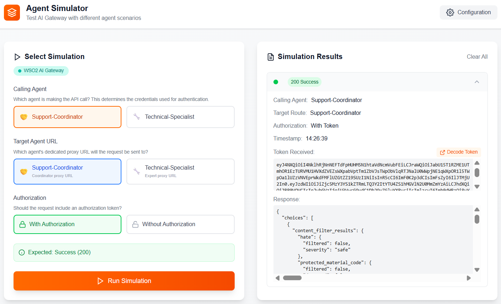

# 🔐 Asgardeo + AI Gateway Integration

An application demonstrating secure authentication and authorization for AI agents using [Asgardeo](https://wso2.com/asgardeo/) identity and access management with AI Gateways. 

---

## 📑 Table of Contents

- [Architecture](#️-architecture)
- [Prerequisites](#-prerequisites)
- [Getting Started](#-getting-started)
- [Configuration](#️-configuration)
- [Simulation Scenarios](#-simulation-scenarios)
- [Contributing](#-contributing)

---

## 🏗️ Architecture

This application demonstrates a secure architecture where:

1. **AI Agents** authenticate with Asgardeo using their unique credentials
2. **JWT tokens** are obtained through Asgardeo
3. **Requests** are routed through an AI Gateway (**Kong** or **WSO2**)
4. **Identity validation** ensures agents can only act as themselves
5. **AI services** are protected from unauthorized access

```
Agent → Asgardeo (Auth) → AI Gateway → AI Services
```

---

## 📋 Prerequisites

Before you begin, ensure you have the following:

- **Node.js** (v24 or higher)
- **npm** or **yarn** package manager
- An **Asgardeo** account (create one at [asgardeo.io](https://wso2.com/asgardeo))
- An **AI Gateway** configured and accessible (WSO2/KONG)
- **Application** created in Asgardeo Console

### Asgardeo and AI Gateway Setup

Choose your preferred AI Gateway and follow the corresponding setup guide:

- **WSO2 AI Gateway[Link neeeds to be added]** — Configure WSO2 with Asgardeo for agent authentication
- **Kong AI Gateway[Link neeeds to be added]** — Configure Kong with Asgardeo for agent authentication

---

## 🚀 Getting Started

1. **Clone the repository:**
   ```bash
   git clone https://github.com/wso2/iam-ai-samples
   cd asgardeo-agent-identity-with-ai-gateway
   ```

2. **Install dependencies:**
   ```bash
   npm install
   ```

3. **Configure environment variables:**
   ```bash
   cp .env.example .env
   ```
   Open `.env` and fill in your values. See the [Configuration](#️-configuration) section for details.

4. **Start the development server:**
   ```bash
   npm run dev
   ```

5. **Open your browser:**
   
   Navigate to [http://localhost:3000](http://localhost:3000)

---

## ⚙️ Configuration

Configuration is provided via a `.env` file. A `.env.example` file is included in the project — copy it and fill in your values:

```bash
cp .env.example .env
```

### Environment Variables

| Variable | Description | Example |
|----------|-------------|---------|
| `NEXT_PUBLIC_GATEWAY_TYPE` | Gateway type — `"kong"` or `"wso2"` | `kong` |
| `NEXT_PUBLIC_ORG_NAME` | Your Asgardeo organization identifier | `aigateway` |
| `NEXT_PUBLIC_CLIENT_ID` | Application Client ID from Asgardeo Console | `tcHmGhEG3t353z2Df6iRc3jlzPwa` |

#### Kong AI Gateway
| Variable | Description | Example |
|----------|-------------|---------|
| `NEXT_PUBLIC_TARGET_URL` | Single Kong AI Gateway proxy URL endpoint (header-based routing) | `https://kong-gateway.example.com/api` |

#### WSO2 AI Gateway
Make sure you get the final URLs from the test console by executing once.

| Variable | Description | Example |
|----------|-------------|---------|
| `NEXT_PUBLIC_WSO2_COORDINATOR_URL` | AI proxy URL for the Support-Coordinator agent | `https://wso2-gateway.example.com/coordinator/chat` |
| `NEXT_PUBLIC_WSO2_EXPERT_URL` | AI proxy URL for the Technical-Specialist agent | `https://wso2-gateway.example.com/expert/chat` |

#### Agent Credentials
| Variable | Description |
|----------|-------------|
| `COORDINATOR_AGENT_ID` | Agent ID for the Support-Coordinator agent |
| `COORDINATOR_AGENT_SECRET` | Agent Secret for the Support-Coordinator agent |
| `EXPERT_AGENT_ID` | Agent ID for the Technical-Specialist agent |
| `EXPERT_AGENT_SECRET` | Agent Secret for the Technical-Specialist agent |

---

## 🧪 Simulation Scenarios

The application provides a flexible simulation panel where you configure each request by selecting three options:



| Option | Description |
|--------|-------------|
| **Calling Agent** | Which agent is making the call (`Support-Coordinator` or `Technical-Specialist`) — determines the credentials used |
| **Target Agent URL** | Which agent's route or proxy URL the request is sent to |
| **Authorization** | Whether to include a Bearer token or send the request unauthenticated |

The simulation panel adapts based on the configured **AI Gateway Type**:

- **Kong AI Gateway** — sends all requests to a single URL with an `x-agent-type` header for routing
- **WSO2 AI Gateway** — sends requests directly to the selected agent's dedicated proxy URL (no header-based routing)

---

### Scenario: Correct Route ✅

**Selection:** Calling Agent = X, Target Route = X, Authorization = With Token

**Expected Result:** `200 Success` — Request is authorized and processed

**Details:**
- Agent authenticates with its own credentials and calls its own route/URL
- Token subject matches the target identity
- AI Gateway allows the request

---

### Scenario: Wrong Route ❌

**Selection:** Calling Agent = X, Target Route = Y, Authorization = With Token

**Expected Result:** `403 Denied` — Request is rejected due to identity mismatch

**Details:**
- Agent authenticates as itself but targets a different agent's route/URL
- Token subject doesn't match the claimed identity
- AI Gateway detects the mismatch and blocks the request
- Demonstrates protection against impersonation attacks

---

### Scenario: No Authentication 🚫

**Selection:** Any Agent, Any Route, Authorization = Without Token

**Expected Result:** `401 Unauthorized` — Request fails due to missing authentication

**Details:**
- No Bearer token is provided
- AI Gateway rejects unauthenticated requests
- Demonstrates baseline security enforcement

---

## 🎯 Simulation Features

For each simulation, you can:

- **View the Token**: Inspect the JWT access token received from Asgardeo
- **Decode the Token**: See the token's claims, expiration, and subject
- **Analyze the Response**: View the Gateway's response including status codes and messages
- **Compare Scenarios**: Understand how different authentication states affect authorization
---
## 🤝 Contributing

Contributions are welcome! Please feel free to submit a Pull Request.

---

## 🔗 Useful Links

- [Asgardeo Documentation](https://wso2.com/asgardeo/docs/)
- [WSO2 AI Gateway Documentation](https://wso2.com/bijira/docs/)
- [KONG AI Gateway Documentation](https://developer.konghq.com/index/ai-gateway/)
