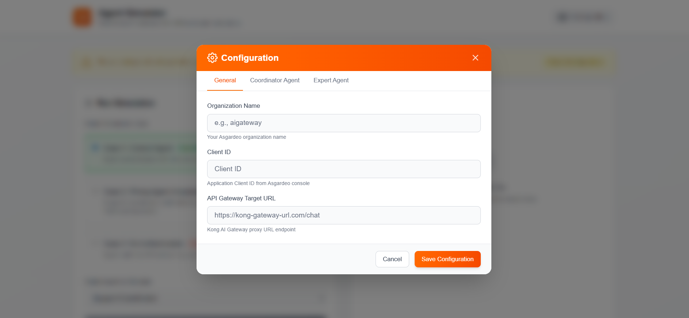
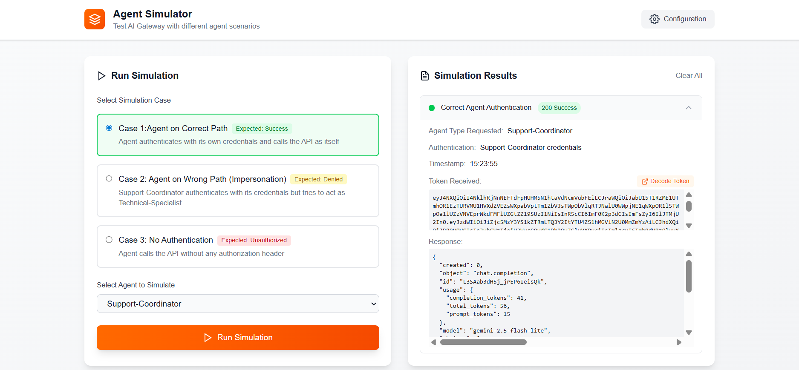

# 🔐 Asgardeo + AI Gateway Integration

A application demonstrating secure authentication and authorization for AI agents using [Asgardeo](https://wso2.com/asgardeo/) identity and access management with AI Gateways. 

---

## 📑 Table of Contents

- [Architecture](#-architecture)
- [Prerequisites](#-prerequisites)
- [Getting Started](#-getting-started)
- [Configuration](#-configuration)
- [Simulation Scenarios](#-simulation-scenarios)
- [Contributing](#-contributing)

---

## 🏗️ Architecture

This application demonstrates a secure architecture where:

1. **Agents** authenticate with Asgardeo using their unique credentials
2. **JWT tokens** are obtained through Asgardeo
3. **Requests** are routed through AI Gateway
4. **Identity validation** ensures agents can only act as themselves
5. **AI services** are protected from unauthorized access

```
Agent → Asgardeo (Auth) → Application → AI Gateway → AI Service
```

---

## 📋 Prerequisites

Before you begin, ensure you have the following:

- **Node.js** (v18 or higher)
- **npm** or **yarn** package manager
- **Asgardeo account** (create one at [asgardeo.io](https://asgardeo.io))
- **An AI Gateway** configured and accessible
- **Application** created in Asgardeo Console

### Asgardeo Setup

1. Log in to [Asgardeo Console](https://console.asgardeo.io/)
2. Create a new **Public Client** application
3. Note your **Organization Name** and **Client ID**
4. Create service accounts for your agents:
   - Support-Coordinator Agent
   - Technical-Specialist Agent

---

## 🚀 Getting Started

1. **Clone the repository:**
   ```bash
   git clone <repository-url>
   cd asgardeo-and-ai-gateway-integration
   ```

2. **Install dependencies:**
   ```bash
   npm install
   ```

3. **Start the development server:**
   ```bash
   npm run dev
   ```

4. **Open your browser:**
   
   Navigate to [http://localhost:3000](http://localhost:3000)

---

## ⚙️ Configuration

When you first launch the application, you'll be prompted to configure the following settings:



### Configuration Parameters

| Parameter | Description | Example |
|-----------|-------------|---------|
| **Organization Name** | Your Asgardeo organization identifier | `org123` |
| **Client ID** | The Client ID from your Asgardeo Public Client | `abc123xyz` |
| **API Gateway URL** | Your  AI Gateway endpoint URL | `https://gateway.example.com/api` |
| **Support-Coordinator Credentials** | Username and password for the Support-Coordinator agent | - |
| **Technical-Specialist Credentials** | Username and password for the Technical-Specialist agent | - |

### Configuration Steps

1. Click the **Configuration** button in the application
2. Fill in all required fields
3. Click **Save Configuration**
4. The settings are stored in your browser's session storage

---

## 🧪 Simulation Scenarios

The application includes three test scenarios to demonstrate authentication and authorization:



### Case 1: Correct Agent ✅

**Scenario:** Agent authenticates with its own credentials and calls the API as itself

**Expected Result:** `Success` - Request is authorized and processed

**Details:**
- Support-Coordinator uses Support-Coordinator credentials
- Technical-Specialist uses Technical-Specialist credentials
- Token contains correct subject and roles
- AI Gateway allows the request

---

### Case 2: Wrong Agent (Impersonation) ❌

**Scenario:** Support-Coordinator authenticates with its credentials but tries to act as Technical-Specialist

**Expected Result:** `Denied` - Request is rejected due to identity mismatch

**Details:**
- Agent attempts to impersonate another agent
- Token subject doesn't match the claimed identity
- AI Gateway detects the mismatch and blocks the request
- Demonstrates protection against impersonation attacks

---

### Case 3: No Authentication 🚫

**Scenario:** Agent calls the API without any authorization header

**Expected Result:** `Unauthorized` - Request fails due to missing authentication

**Details:**
- No Bearer token is provided
- AI Gateway rejects unauthenticated requests
- Demonstrates baseline security enforcement

---

## 🎯 Simulation Features

For each simulation, you can:

- **View the Token**: Inspect the JWT access token received from Asgardeo
- **Decode the Token**: See the token's claims, expiration, and subject
- **Analyze the Response**: View the Gateway's response including status codes and messages
- **Compare Scenarios**: Understand how different authentication states affect authorization
---
## 🤝 Contributing

Contributions are welcome! Please feel free to submit a Pull Request.

---

## 🔗 Useful Links

- [Asgardeo Documentation](https://wso2.com/asgardeo/docs/)