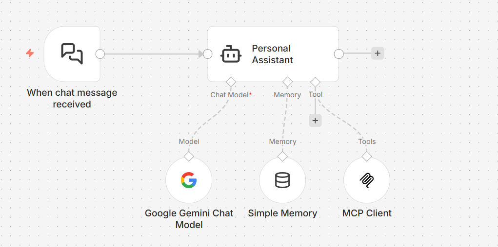

# n8n MCP Client Application

## Prerequisites

- Docker, or
- Node.js v16 or later

## Running n8n

To install and run n8n locally using either **Docker** or **Node.js**, follow this [step-by-step](https://community.n8n.io/t/how-to-install-n8n-locally-docker-or-node-js-step-by-step/228296) guide from the n8n community:

## Import the MCP Client Workflow

After n8n is running, open the n8n UI in your browser and select **Create Workflow**.

Then choose **Import from File**, and select:

- `mcp-client-n8n-example.json`

This creates the preconfigured MCP client workflow in n8n.

