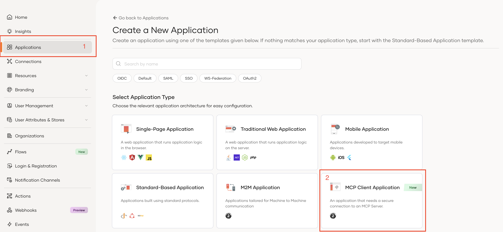
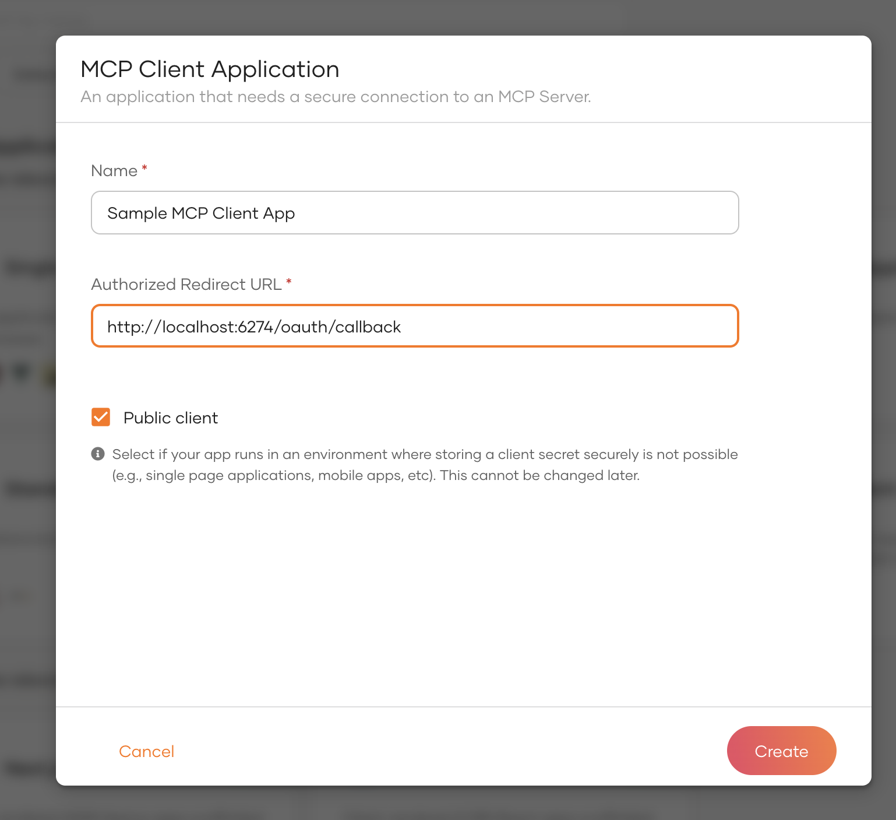
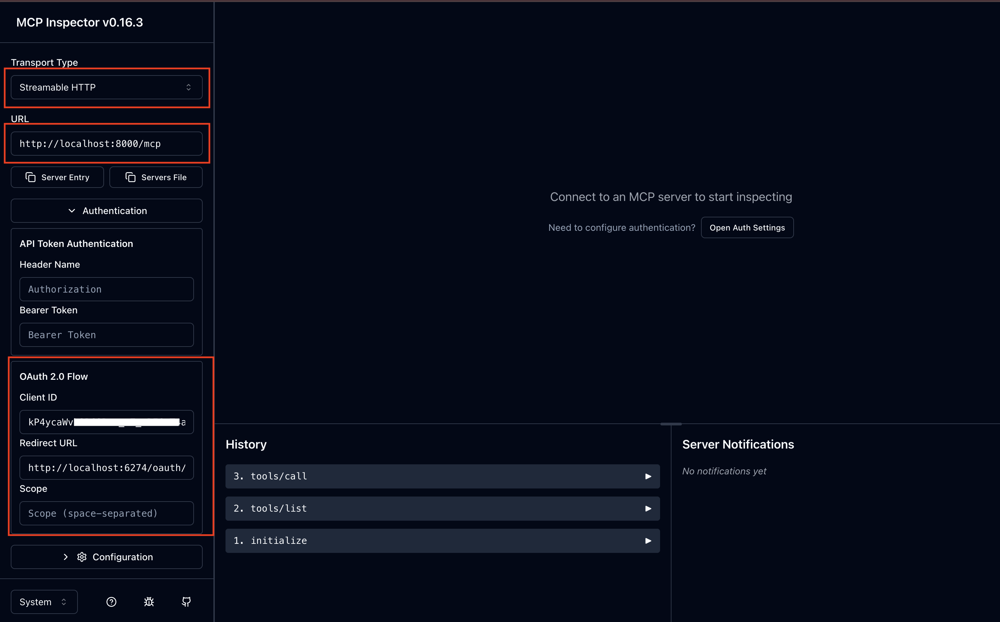
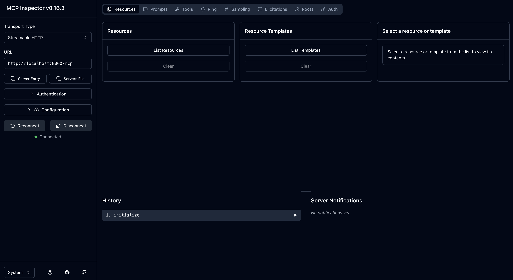

# MCP Auth Python Quick Start Guide - Asgardeo Integration

This project demonstrates how to create a secured MCP (Model Context Protocol) server in Python with FastMCP framework, using Asgardeo as the OAuth2/OIDC provider.

## Prerequisites

- Python 3.12 or higher
- Asgardeo account and application setup
- pip (Python package installer)

## Project Structure

```
├── main.py              # Main FastMCP server application
├── jwt_validator.py     # JWT validation module
├── .env                 # Environment variables configuration
├── README.md           # This file
└── requirements.txt    # Python dependencies
```

## Installation

1. **Clone or download this project**

2. **Create a virtual environment (recommended)**
   ```bash
   python -m venv .venv
   source .venv/bin/activate  # On Windows: .venv\Scripts\activate
   ```

3. **Install required dependencies**
   ```bash
   pip install -r requirements.txt
   ```

4. **Configure environment variables**
   
   Create a `.env` file in the project root directory with your Asgardeo configuration:
   
   ```bash
   # Asgardeo OAuth2 Configuration
   AUTH_ISSUER=https://api.asgardeo.io/t/<your-tenant>/oauth2/token
   CLIENT_ID=<your-client-id>
   JWKS_URL=https://api.asgardeo.io/t/<your-tenant>/oauth2/jwks
   ```
   
   **Example with actual values:**
   ```bash
   # Asgardeo OAuth2 Configuration
   AUTH_ISSUER=https://api.asgardeo.io/t/mycompany/oauth2/token
   CLIENT_ID=abc123xyz789_client_id_from_asgardeo
   JWKS_URL=https://api.asgardeo.io/t/mycompany/oauth2/jwks
   ```

## Asgardeo Configuration

### 1. Create an Asgardeo Application

1. Login to your Asgardeo account.
2. Navigate to the Applications Tab and selct the **MCP Client Application** as shown in below image.


3. Add your application name and callback URL


### 2. Get Your Application Credentials

Once the application is created get both the **Client ID** and **Tenant Name**:
- **Client ID**: Found in the application's **Protocol** tab
- **Tenant Name**: Your organization's tenant name (visible in the URL)

### 3. Configure the Application

The application now uses environment variables for configuration. Make sure you have created the `.env` file as described in the Installation section above.

Replace the placeholders in your `.env` file:
- Replace `<your-tenant>` with your actual Asgardeo tenant name
- Replace `<your-client-id>` with your actual OAuth2 client ID from Asgardeo

**Security Note**: Never commit your `.env` file to version control. Add `.env` to your `.gitignore` file to keep your credentials secure.

## Running the Server

### Development Mode

1. **Start the server**
   ```bash
   python main.py
   ```

2. **Server will start on**: `http://localhost:8000` using `streamable-http` transport


## Test with MCP Inspector

### Setup MCP Inspector
Run latest MCP Inspector UI with below command:
   ```bash
   npx @modelcontextprotocol/inspector
   ```
For more information on how to run MCP Inspector, refer to the [MCP Inspector documentation](https://github.com/modelcontextprotocol/inspector?tab=readme-ov-file#mcp-inspector)

**Note**: Make sure to get the Inspector release `0.16.3` or higher version.
   
### Setup the MCP Inspector to connect with the server
1. Once the mcp inspector got started, it will shows the URL where it is running, usually `http://localhost:6274/?MCP_PROXY_AUTH_TOKEN=<Proxy_Token>`.
2. Configure Inspector's callback URL in your Asgardeo application settings:
   - Go to your Asgardeo application settings (You have created this in the previous steps).
   - Navigate to **Protocol** tab
   - Add the callback URL: `http://localhost:6274/oauth/callback` (Port can be changed, make sure to match the port where MCP Inspector is running).
   - Update the application.
3. Open the MCP Inspector in your browser using the URL provided by the MCP Inspector server, e.g., `http://localhost:6274/?MCP_PROXY_AUTH_TOKEN=<Proxy_Token>`.
4. Configure this sample mcp server as shown in below image:

5. Click on the **Connect** button to establish a connection with the MCP server.
   (Once you click on the connect button, it will redirect you to the Asgardeo login page, where you can login with your Asgardeo credentials.)

6. Once connected, you can start testing the available `add` tool by navigating the **Tools** tab in the MCP Inspector.

## Available Tools

### add Tool

- **Description**: Adds two numbers and returns the computed result.
- **Parameters**: 
  - `a` (float): First number
  - `b` (float): Second number
- **Authentication**: Required (valid JWT token).
- **Returns**: Returns the computed result.
