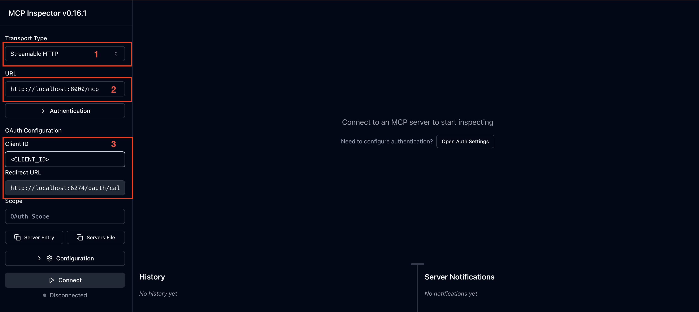
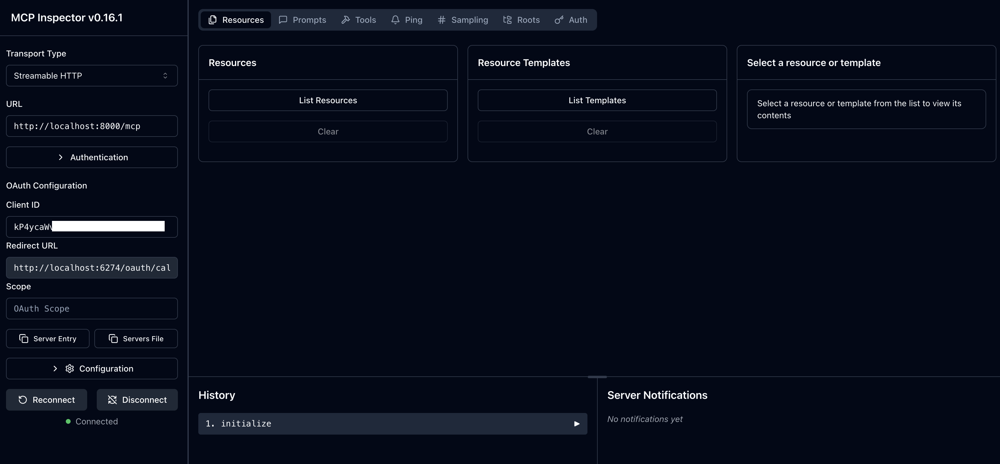

# MCP Auth Python Quick Start Guide - Asgardeo Integration

This project demonstrates how to create an authenticated MCP (Model Context Protocol) server using Python with Asgardeo as the OAuth2/OIDC provider and the FastMCP framework.

## Features

- JWT token validation using JWKS
- Asgardeo OAuth2/OIDC integration
- FastMCP framework with built-in authentication middleware
- Custom JWTTokenVerifier implementation
- Weather service with `get_weather` tool that requires authentication

## Prerequisites

- Python 3.12 or higher
- Asgardeo account and application setup
- pip (Python package installer)

## Project Structure

```
├── main.py              # Main FastMCP server application
├── jwt_validator.py     # JWT validation module
├── README.md           # This file
└── requirements.txt    # Python dependencies
```

## Installation

1. **Clone or download this project**

2. **Create a virtual environment (recommended)**
   ```bash
   python -m venv .venv
   source .venv/bin/activate  # On Windows: .venv\Scripts\activate
   ```

3. **Install required dependencies**
   ```bash
   pip install -r requirements.txt
   ```

## Asgardeo Configuration

### 1. Create an Asgardeo Application

1. Login to your Asgardeo account.
2. Navigate to the Applications Tab and select the **MCP Client Application** as shown in below image.


3. Add your application name and callback URL


### 2. Get Your Application Credentials

Once the application is created get both the **Client ID** and **Tenant Name**:
- **Client ID**: Found in the application's **Protocol** tab
- **Tenant Name**: Your organization's tenant name (visible in the URL)

### 3. Configure the Application

Edit `main.py` and update the following variables:

```python
# Replace 'your-tenant' with your actual Asgardeo tenant name
AUTH_ISSUER = "https://api.asgardeo.io/t/<your-tenant>/oauth2/token"
CLIENT_ID = "your-client-id-here"  # Replace with your Asgardeo OAuth2 client ID
JWKS_URL = "https://api.asgardeo.io/t/<your-tenant>/oauth2/jwks"
```

**Example with actual values:**
```python
AUTH_ISSUER = "https://api.asgardeo.io/t/mycompany/oauth2/token"
CLIENT_ID = "abc123xyz789_client_id_from_asgardeo"
JWKS_URL = "https://api.asgardeo.io/t/mycompany/oauth2/jwks"
```

Also update the AuthSettings URLs:
```python
auth=AuthSettings(
    issuer_url=AnyHttpUrl("https://api.asgardeo.io/t/<your-tenant>/oauth2/token"),
    resource_server_url=AnyHttpUrl("http://localhost:8000"),
    # required_scopes=["user"]  # Uncomment and modify if you need specific scopes
),
```

## Running the Server

### Development Mode

1. **Start the server**
   ```bash
   python main.py
   ```

2. **Server will start on**: `http://localhost:8000` using streamable-http transport


## Test with MCP Inspector
** Note **: Currently MCP Inspector doesn't support getting the authorization server information with `.well-known/openid-configuration`. Therefore, we are going to use a customized inspector that is supported. Please get it from here: [MCP Inspector](https://github.com/shashimalcse/inspector/tree/fix-auth)

### Setup MCP Inspector
1. Clone the MCP Inspector repository:
   ```bash
    git clone https://github.com/shashimalcse/inspector
    ```
2. Navigate to the cloned directory:
    ```bash
    cd inspector
    ```
3. Checkout to the `fix-auth` branch:
    ```bash
    git fetch origin fix-auth
    git checkout fix-auth
    ```
4. Install the required dependencies (Make sure you have Node version 22 or higher):
    ```bash
    npm install
    ```
5. Start the MCP Inspector:
    ```bash
   npm run dev
    ```
   
### Setup the MCP Inspector to connect with the server
1. Once the mcp inspector got started, it will shows the URL where it is running, usually `http://localhost:6274/?MCP_PROXY_AUTH_TOKEN=<Proxy_Token>`.
2. Configure Inspector's callback URL in your Asgardeo application settings:
   - Go to your Asgardeo application settings (You have created this in the previous steps).
   - Navigate to Protocol tab
   - Add the callback URL: `http://localhost:6274/oauth/callback` (Port can be changed, make sure to match the port where MCP Inspector is running).
   - Update the application.
3. Open the MCP Inspector in your browser using the URL provided by the MCP Inspector server, e.g., `http://localhost:6274/?MCP_PROXY_AUTH_TOKEN=<Proxy_Token>`.
4. Configure this sample mcp server as shown in below image:

5. Click on the **Connect** button to establish a connection with the MCP server.
   (Once you click on the connect button, it will redirect you to the Asgardeo login page, where you can login with your Asgardeo credentials.)

6. Once connected, you can start testing the available get_weather tool by navigating the **Tools** tab in the MCP Inspector.

## Available Tools

### get_weather Tool

- **Description**: Get weather data for a city
- **Parameters**: 
  - `city` (optional): City name (defaults to "London")
- **Authentication**: Required (valid JWT token)
- **Returns**: Weather information including temperature, condition, and humidity


## Configuration Options
### JWT Validation Settings

The JWTTokenVerifier supports the following features:
- **Algorithm**: RS256 (configurable in JWTValidator)
- **Expiration**: Verified automatically
- **Audience**: Verified against CLIENT_ID
- **Issuer**: Verified against AUTH_ISSUER
- **Scopes**: Extracted and included in AccessToken
