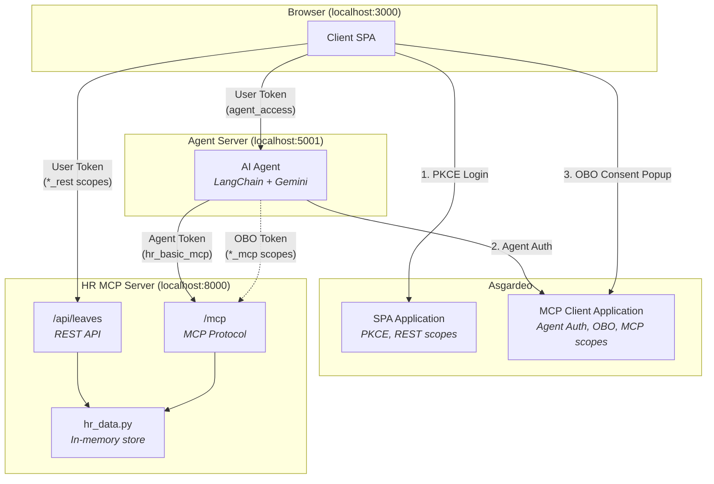

# Smart Employee Agent v2

A sample application demonstrating **three IAM patterns for AI agents** using [Asgardeo](https://asgardeo.io). An AI-powered Corporate Concierge handles HR leave management with fine-grained access control — from basic queries with the agent's own credentials, to elevated actions on behalf of individual users.

**Key difference from v1:** No internal employee IDs (like EMP001). Any Asgardeo user with the right role/permissions can use the system immediately. User identity comes directly from the JWT `sub` claim, and users are auto-registered on first interaction.

## Three IAM Patterns

| Pattern | Description | Token Type | Example |
|---------|-------------|------------|---------|
| **1. Agent as Resource Server** | Client authenticates directly with Asgardeo, sends JWT to agent | User Token (PKCE) | Client calls `POST /api/chat` with Bearer token |
| **2. Agent as Autonomous Client** | Agent authenticates as itself for basic operations | Agent Token (App Native Auth) | Agent queries company holidays, leave policy |
| **3. Agent on Behalf of User** | Agent acts with user's elevated privileges via OBO token | OBO Token (Auth Code + Actor Token) | Agent applies leave, checks balance for user |

## Architecture



**3 components**: Client SPA, Agent Server, HR MCP Server. No database required — all business data is stored in-memory.

**No SCIM2 identity resolution.** Unlike v1, there is no M2M application and no `GET /scim2/Users/{sub}` lookup. User identity comes directly from JWT claims (`sub` + `name`). Users are auto-registered with default leave balances on first interaction.

**Two Asgardeo applications** provide clean IAM separation:
- **SPA Application** — Browser authenticates via PKCE and receives tokens with `*_rest` scopes for direct REST API access (dashboard)
- **MCP Client Application** — Agent authenticates as a first-class identity (App Native Auth) and receives tokens with `*_mcp` scopes for MCP tool invocation. Also handles OBO flow when the agent needs to act on behalf of a user.

## Project Structure

```
smart-employee-agent-v2/
├── client/                     # Browser SPA (port 3000)
│   ├── index.html              # Split-panel UI: login + chat + dashboard
│   ├── app.js                  # PKCE login, chat, OBO popup, dashboard
│   ├── styles.css              # Layout and styling
│   ├── serve.py                # Dev server with /config endpoint
│   └── .env.example
├── agent/                      # Agent Server (port 5001)
│   ├── main.py                 # FastAPI + LangChain + JWT validation
│   ├── session.py              # Per-user session store
│   ├── agent_auth.py           # Agent token management (App Native Auth)
│   ├── obo_flow.py             # OBO flow handling (PKCE + token exchange)
│   ├── requirements.txt
│   └── .env.example
└── hr-mcp-server/              # HR MCP Server (port 8000)
    ├── main.py                 # 9 MCP tools + REST /api/leaves
    ├── hr_data.py              # In-memory HR data (no employee IDs)
    ├── jwt_validator.py        # JWT validation via JWKS
    ├── requirements.txt
    └── .env.example
```

## Prerequisites

- Python 3.10+
- An [Asgardeo](https://asgardeo.io) account (free tier works)
- A [Google AI Studio](https://aistudio.google.com/) API key (for Gemini LLM)

---

## Asgardeo Configuration

### Step 1: Create API Resources

#### REST API Resources (for SPA)

**Agent API Resource** (REST)
- Identifier: `agent-api`
- Scopes: `agent_access`

**HR REST API Resource**
- Identifier: `hr-rest-api`
- Scopes:

| Scope | Description |
|-------|-------------|
| `hr_basic_rest` | Company holidays, leave policy |
| `hr_self_rest` | Own leave balance and requests for dashboard |
| `hr_read_rest` | All leave requests for dashboard |
| `hr_approve_rest` | Role marker for HR Admin |

#### MCP Resources (for Agent)

**HR MCP Resource**
- Identifier: `hr-mcp`
- Scopes:

| Scope | Description |
|-------|-------------|
| `hr_basic_mcp` | Company holidays, leave policy |
| `hr_self_mcp` | Own leave balance, own leave requests, apply for leave |
| `hr_read_mcp` | All leave requests, leave request details |
| `hr_approve_mcp` | Approve/reject pending leave requests |

### Step 2: Register an AI Agent

Agents in Asgardeo are first-class identities (like users) — not OAuth clients.

1. Go to **Console > Agents**
2. Click **+ New Agent**
3. Provide a name (e.g., "Corporate Concierge") and optional description
4. Click **Create**

You will receive:
- **Agent ID** → used in `agent/.env` as `AGENT_ID`
- **Agent Secret** (shown once — store securely) → used in `agent/.env` as `AGENT_SECRET`

### Step 3: Create an SPA Application (for Browser)

The SPA handles browser PKCE login and dashboard REST access.

1. Go to **Applications > New Application > Single-Page Application**
2. Provide a name (e.g., "Smart Employee Client")
3. Authorized redirect URL: `http://localhost:3000/callback`
4. Finish the wizard
5. Under **API Authorization**, subscribe to the REST API Resources:
   - `agent-api` (grant `agent_access`)
   - `hr-rest-api` (grant all: `hr_basic_rest`, `hr_self_rest`, `hr_read_rest`, `hr_approve_rest`)
6. **Configure User Attributes:**
   - Navigate to the **User Attributes** section of the application
   - Under the **profile** section, ensure `given_name` and `family_name` are selected as **Requested** and **Mandatory**
7. **Configure Access Token:**
   - Navigate to the **Protocol** tab → **Access Token** section
   - Set **Token Type** to **JWT**
   - Under the **Access Token Attributes** dropdown, select `given_name` and `family_name`
8. Note the **SPA Client ID** → used in:
   - `client/.env` as `CLIENT_ID`
   - `agent/.env` as `TOKEN_AUDIENCE` (for validating user JWTs)
   - `hr-mcp-server/.env` as `SPA_CLIENT_ID`

### Step 4: Create an MCP Client Application (for Agent)

The MCP Client handles agent authentication (App Native Auth) and OBO flow.

1. Go to **Applications > New Application > MCP Client Application**
2. Provide a name (e.g., "Smart Employee Agent")
3. Authorized redirect URL: `http://localhost:5001/api/obo/callback`
4. Finish the wizard
5. Under **API Authorization**, subscribe to the MCP Resources:
   - `hr-mcp` (grant all: `hr_basic_mcp`, `hr_self_mcp`, `hr_read_mcp`, `hr_approve_mcp`)
6. **Configure User Attributes:**
   - Navigate to the **User Attributes** section of the application
   - Under the **profile** section, ensure `given_name` and `family_name` are selected as **Requested** and **Mandatory**
7. **Configure Access Token:**
   - Navigate to the **Protocol** tab → **Access Token** section
   - Set **Token Type** to **JWT**
   - Under the **Access Token Attributes** dropdown, select `given_name` and `family_name`
8. Note the **MCP Client ID** → used in:
   - `agent/.env` as `ASGARDEO_CLIENT_ID`
   - `hr-mcp-server/.env` as `CLIENT_ID`

### Step 5: Create Roles

| Role | REST Scopes (SPA) | MCP Scopes (Agent/OBO) |
|------|-------------------|----------------------|
| `employee` | `agent_access`, `hr_basic_rest`, `hr_self_rest` | `hr_basic_mcp`, `hr_self_mcp` |
| `hr_admin` | All employee scopes + `hr_read_rest`, `hr_approve_rest` | All employee + `hr_read_mcp`, `hr_approve_mcp` |

### Step 6: Create Demo Users

Create any number of users in your Asgardeo organization and assign them the appropriate role. **No specific usernames required** — any user with the right role will work immediately.

| Example User | Role | What They Can Do |
|-------------|------|------------------|
| Any user | `employee` | View holidays/policy, check own balance, apply for leave |
| Any user | `hr_admin` | Everything an employee can do + view all requests, approve/reject |

> **No identity linking needed.** Users are auto-registered on first interaction with default leave balances (Annual: 20, Sick: 10, Personal: 5).

---

## Setup & Run

### 1. HR MCP Server (Terminal 1)

```bash
cd hr-mcp-server
python3 -m venv .venv && source .venv/bin/activate
pip install -r requirements.txt

cp .env.example .env
# Edit .env:
#   AUTH_ISSUER=https://api.asgardeo.io/t/<tenant>/oauth2/token
#   CLIENT_ID=<mcp-client-app-client-id>
#   SPA_CLIENT_ID=<spa-app-client-id>
#   JWKS_URL=https://api.asgardeo.io/t/<tenant>/oauth2/jwks

python main.py   # Runs on port 8000
```

### 2. Agent Server (Terminal 2)

```bash
cd agent
python3 -m venv .venv && source .venv/bin/activate
pip install -r requirements.txt

cp .env.example .env
# Edit .env:
#   ASGARDEO_BASE_URL=https://api.asgardeo.io/t/<tenant>
#   ASGARDEO_CLIENT_ID=<mcp-client-app-client-id>
#   AGENT_ID=<agent-id-from-console-agents>
#   AGENT_SECRET=<agent-secret-from-console-agents>
#   TOKEN_AUDIENCE=<spa-app-client-id>
#   OBO_REDIRECT_URI=http://localhost:5001/api/obo/callback
#   JWKS_URL=https://api.asgardeo.io/t/<tenant>/oauth2/jwks
#   AUTH_ISSUER=https://api.asgardeo.io/t/<tenant>/oauth2/token
#   GOOGLE_API_KEY=<your-google-api-key>

python main.py   # Runs on port 5001
```

### 3. Client (Terminal 3)

```bash
cd client
pip install python-dotenv   # Only dependency

cp .env.example .env
# Edit .env:
#   ASGARDEO_BASE_URL=https://api.asgardeo.io/t/<tenant>
#   CLIENT_ID=<spa-app-client-id>

python serve.py   # Runs on port 3000
```

### 4. Open the App

Go to **http://localhost:3000**. Click "Sign In" and log in with any Asgardeo user that has the `employee` or `hr_admin` role.

---

## Usage

### Basic Queries (Agent Token — No OBO Needed)

These work immediately with the agent's own `hr_basic_mcp` credentials:

- "What are the company holidays this year?"
- "What is the leave policy?"

### Elevated Actions (OBO Required)

When you ask something that requires the user's own scopes, the agent returns an **"Authorize"** button:

- "What is my leave balance?" → needs `hr_self_mcp`
- "Apply for 5 days annual leave March 10-14" → needs `hr_self_mcp`
- "Show my leave requests" → needs `hr_self_mcp`

Click **Authorize Me** → popup opens → consent → popup closes → agent retries with OBO token.

### Role-Specific Actions

**As an Employee:**
- "What is my leave balance?" → shows default 20/10/5
- "Apply for sick leave March 5-6, not feeling well" → creates LR001
- "Show my leave requests" → lists own requests

**As an HR Admin:**
- "Show all pending leave requests" → lists all org requests
- "Get details for LR001" → full request details
- "Approve leave request LR001" → approves, deducts balance
- "Reject LR002 — insufficient notice" → rejects with reason

### Role Limitations

If a user tries an action beyond their role, the agent explains politely:
- Employee asks "Approve leave LR001" → agent explains Employee role can't approve

---

## MCP Tools (9 tools)

| Tool | MCP Scope | Identity | Token |
|------|-----------|----------|-------|
| `get_company_holidays` | `hr_basic_mcp` | No | Agent |
| `get_leave_policy` | `hr_basic_mcp` | No | Agent |
| `get_my_leave_balance` | `hr_self_mcp` | Yes | OBO |
| `get_my_leave_requests` | `hr_self_mcp` | Yes | OBO |
| `apply_leave` | `hr_self_mcp` | Yes | OBO |
| `get_all_leave_requests` | `hr_read_mcp` | No | OBO |
| `get_leave_request_details` | `hr_read_mcp` | No | OBO |
| `approve_leave_request` | `hr_approve_mcp` | Yes | OBO |
| `reject_leave_request` | `hr_approve_mcp` | Yes | OBO |

---

## Test Checklist

### Authentication Tests

| # | Test | Expected |
|---|------|----------|
| 1 | PKCE login (Employee) | Login succeeds, role badge shows "Employee" (green) |
| 2 | PKCE login (HR Admin) | Login succeeds, role badge shows "HR Admin" (blue) |
| 3 | Sign out | Returns to login overlay, clears token |

### Dashboard Tests

| # | Test | User | Expected |
|---|------|------|----------|
| 4 | Dashboard loads | Employee | Shows "My Leave Requests" (own data only) |
| 5 | Dashboard loads | HR Admin | Shows "All Leave Requests" (all employees) |
| 6 | Dashboard refresh | Any | After a chat action, dashboard updates automatically |

### Basic Chat (Agent Token — No OBO)

| # | Test | Expected |
|---|------|----------|
| 7 | "What are the company holidays?" | Returns list of holidays (no authorize button) |
| 8 | "What is the leave policy?" | Returns leave type rules |

### OBO Flow Tests

| # | Test | Expected |
|---|------|----------|
| 9 | Ask "my leave balance" (first time) | "Authorize Me" button appears |
| 10 | Click Authorize → consent | Popup closes → agent retries → shows balance (20/10/5) |
| 11 | Ask "apply for sick leave Mar 5-6" | Works without re-authorization |
| 12 | Multiple elevated requests | All work without re-authorization |

### Employee Role Tests

| # | Test | Expected |
|---|------|----------|
| 13 | "What is my leave balance?" | Shows annual: 20, sick: 10, personal: 5 |
| 14 | "Show my leave requests" | Shows own requests |
| 15 | "Apply for personal leave March 20-21 for moving" | Creates new leave request (LR001) |
| 16 | "Approve leave LR001" | **Role limitation**: agent explains Employee can't approve |

### HR Admin Tests

| # | Test | Expected |
|---|------|----------|
| 17 | "Show all pending leave requests" | Returns all pending requests across org |
| 18 | "Get details for LR001" | Returns full details including employee name |
| 19 | "Approve leave request LR001" | Approves, records reviewer, deducts balance |
| 20 | "Reject LR002 — insufficient notice" | Rejects with reason |

### Error & Reset Tests

| # | Test | Expected |
|---|------|----------|
| 21 | Chat without login | 401 → auto sign-out |
| 22 | Empty message | Error: "Message cannot be empty" |
| 23 | Click "Reset Data" | Resets all in-memory data → signs out → fresh start |

---

## Troubleshooting

### "Agent error" on startup
- Ensure the HR MCP server is running before starting the agent
- Verify `AGENT_ID` and `AGENT_SECRET` in `agent/.env` match the values from Console > Agents
- Verify `ASGARDEO_CLIENT_ID` in `agent/.env` matches the MCP Client Application's Client ID

### Dashboard shows no data / 403
- Confirm the user's role grants the required REST scopes (`hr_self_rest` for employees, `hr_read_rest` for HR Admins)
- Check that `SPA_CLIENT_ID` in the MCP server `.env` matches the SPA application

### OBO popup fails
- Allow popups for `localhost:3000` in your browser
- Verify `OBO_REDIRECT_URI=http://localhost:5001/api/obo/callback` matches the MCP Client Application's redirect URI in Asgardeo
- Ensure the agent has been registered and has valid credentials

### JWT validation fails
- Ensure `AUTH_ISSUER` and `JWKS_URL` match across all `.env` files
- `TOKEN_AUDIENCE` in `agent/.env` must be the **SPA** app's Client ID (not the MCP Client's)
- `ASGARDEO_CLIENT_ID` in `agent/.env` must be the **MCP Client** app's Client ID
- `CLIENT_ID` in `hr-mcp-server/.env` must be the **MCP Client** app's Client ID
- `SPA_CLIENT_ID` in `hr-mcp-server/.env` must be the **SPA** app's Client ID

### Token missing scopes
- Check that API Resources are authorized for the application in Asgardeo
- Verify role-to-scope assignments include the needed scopes
- Ensure the user is assigned to the correct role
